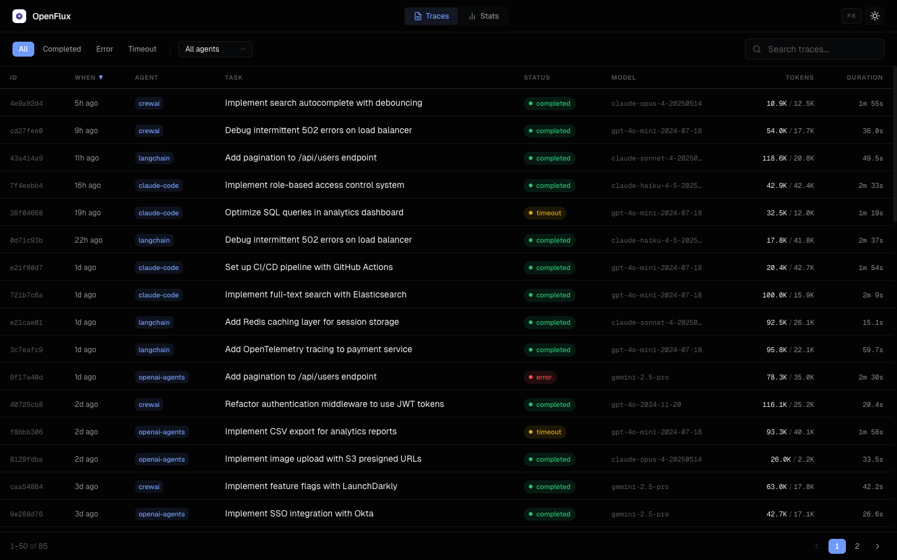
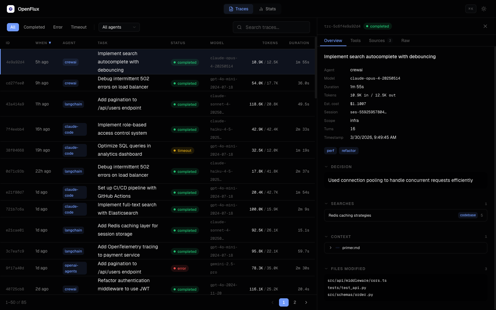
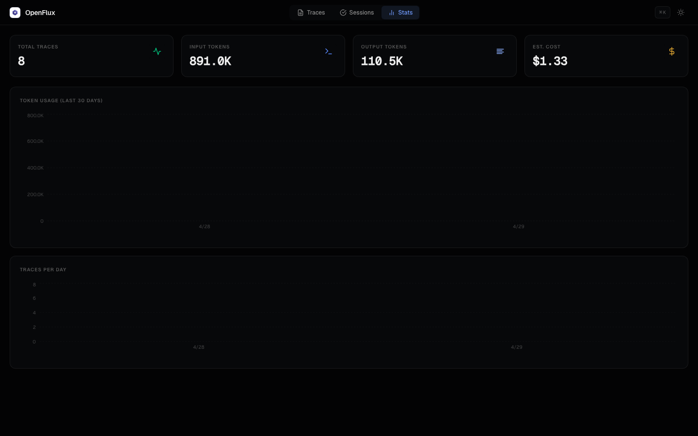
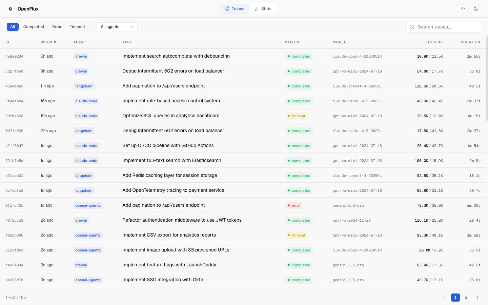

<p align="center">
  <picture>
    
  </picture>
</p>
<h1 align="center">OpenFlux</h1>
<p align="center">
  <em>Open standard for AI agent telemetry. One schema across every framework.</em>
</p>
<p align="center">
  <a href="https://pypi.org/project/openflux/"></a>
  <a href="https://pypi.org/project/openflux/"></a>
  <a href="https://www.python.org/downloads/"></a>
  <a href="https://opensource.org/licenses/MIT"></a>
</p>

## Why

Every agent framework emits telemetry differently. Claude Code uses lifecycle hooks. OpenAI Agents SDK has TracingProcessor. LangChain has callbacks. If you want to build analytics, compliance, or cost tooling on top, you need N integrations from scratch.

OpenFlux normalizes everything into a single schema called a **Trace**: one traced unit of agent work, end to end. Context in, searches run, sources read, tools called, decision made.

Same idea as OpenTelemetry for observability. OTel didn't build dashboards. It built the standard that let them exist. OpenFlux does that for agent telemetry.

## How it works

```
Adapter (framework-specific) -> Normalizer -> Trace -> Sink(s)
```

- **Adapters** hook into framework callbacks and emit raw events
- **Normalizer** classifies events, hashes content, applies fidelity controls
- **Trace** is the universal schema (22 fields + 4 nested record types)
- **Sinks** write the Trace somewhere: SQLite (default), OTLP, or JSON stdout

Zero dependencies beyond Python stdlib for the core. Each adapter adds one optional dep.

## Dashboard

OpenFlux ships with a built-in web dashboard. Run `openflux serve` and open your browser.

<p align="center">
  
</p>

**Trace Explorer** with sortable columns, status filters, full-text search, and agent filtering. Click any row to open the detail panel.

<p align="center">
  
</p>

**Trace Detail** panel with tabs for overview, tools, sources, and raw JSON. Collapsible sections, metadata grid, and cost estimation.

<p align="center">
  
</p>

**Stats Dashboard** with token usage over time, traces per day, and aggregate metrics. Light mode also supported:

<p align="center">
  
</p>

## Install

```bash
pip install openflux

# With a specific adapter
pip install openflux[openai]
pip install openflux[langchain]
pip install openflux[bedrock]

# Everything
pip install openflux[all]
```

## Quick start

### Claude Code

Auto-configures lifecycle hooks:

```bash
openflux install claude-code
```

Every Claude Code session is now traced automatically.

### OpenAI Agents SDK

```python
from agents.tracing import add_trace_processor
from openflux.adapters.openai_agents import OpenFluxProcessor

add_trace_processor(OpenFluxProcessor(agent="my-agent"))
```

### LangChain

```python
import openflux

handler = openflux.langchain_handler(agent="my-rag-app")
result = chain.invoke({"input": "..."}, config={"callbacks": [handler]})
```

### Any framework

```python
import openflux

collector = openflux.init(agent="my-agent")

collector.record_event("session-1", {"type": "meta", "task": "fix auth bug", "model": "gpt-4o"})
collector.record_event("session-1", {"type": "tool", "tool_name": "Bash", "tool_input": "pytest", "tool_output": "3 passed"})
collector.record_event("session-1", {"type": "search", "query": "oauth best practices", "engine": "web"})

trace = collector.flush("session-1")
```

## CLI

OpenFlux includes a full CLI for querying, analyzing, and serving your traces.

```bash
openflux recent                          # last 10 traces
openflux recent --agent claude-code      # filter by agent
openflux search "staging deploy"         # full-text search
openflux trace trc-a1b2c3d4e5f6          # full detail for one trace
openflux cost                            # token usage + cost breakdown
openflux cost --days 7 --agent my-agent  # scoped cost report
openflux export > traces.json            # dump as NDJSON
openflux status                          # db path, counts, breakdown
openflux serve                           # launch web dashboard on :5173
openflux serve --port 8080               # custom port
openflux forget --agent old-agent        # delete traces by agent
openflux prune --days 90                 # remove traces older than 90 days
openflux install claude-code             # auto-configure hooks
openflux install --list                  # show available adapters
```

### `openflux cost`

Shows token usage and estimated cost broken down by model, agent, and day:

```
$ openflux cost --days 7
Token Usage (last 7 days)
─────────────────────────────────────────────
  Traces:     42
  Input:       1,234,567 tokens
  Output:        456,789 tokens
  Total:       1,691,356 tokens

By model:
  claude-sonnet-4-20250514           980,000 tokens  $7.35
  gpt-4o-2024-11-20                  711,356 tokens  $4.28

By agent:
  claude-code                          28 traces    1,200,000 tokens
  my-rag-app                           14 traces      491,356 tokens
```

### `openflux serve`

Launches a local web dashboard with:

- **Trace table** with sorting, pagination, status/agent filtering, full-text search
- **Detail panel** with tabbed view (overview, tools, sources, raw JSON)
- **Stats page** with token usage charts, trace counts, cost estimates
- **Command palette** (Cmd+K) for quick navigation
- **Dark/light mode** toggle

The dashboard is built with React, Tailwind CSS, and Recharts, bundled into the Python package. No Node.js required to run it.

## Adapter coverage

Tested with real API calls and simulated event streams. Coverage = percentage of the 22 Trace fields populated in a real test.

| Adapter | Coverage | What's N/A | Install |
|---------|----------|------------|---------|
| MCP | 22/22 (100%) | -- | `openflux[mcp]` |
| Amazon Bedrock | 21/22 (100%) | files_modified | `openflux[bedrock]` |
| OpenAI Agents SDK | 21/21 (100%) | correction | `openflux[openai]` |
| Claude Code | 21/22 (95%) | parent_id | `(stdlib)` |
| LangChain | 20/20 (100%) | correction, parent_id | `openflux[langchain]` |
| Claude Agent SDK | 19/19 (100%) | parent_id, correction, files_modified | `openflux[claude-agent-sdk]` |
| Google ADK | 18/18 (100%) | parent_id, correction, files_modified, searches | `openflux[google-adk]` |
| AutoGen v0.4 | 16/16 (100%) | parent_id, correction, searches, sources_read, tools_used, files_modified | `openflux[autogen]` |
| CrewAI | 17/18 (94%) | parent_id, correction, files_modified, token_usage | `openflux[crewai]` |

## Configuration

All env vars, no config files.

| Variable | Default | Purpose |
|---|---|---|
| `OPENFLUX_DB_PATH` | `~/.openflux/traces.db` | SQLite database location |
| `OPENFLUX_OTLP_ENDPOINT` | `http://localhost:4318` | OTLP/HTTP endpoint for export |
| `OPENFLUX_FIDELITY` | `full` | `full` (raw content) or `redacted` (hash-only) |
| `OPENFLUX_EXCLUDE_PATHS` | `*.env,*credentials*,...` | Glob patterns to exclude from content storage |

## Schema

A Trace captures one complete unit of agent work:

- **Identity**: id, timestamp, agent, session_id, parent_id
- **What happened**: task, decision, status, correction
- **Provenance**: context given, searches run, sources read, tools called
- **Metrics**: token usage, duration, turn count, files modified
- **Extensibility**: tags, scope, metadata dict

Full schema definition in [docs/schema.md](docs/schema.md).

## Sinks

| Sink | Description | Config |
|------|-------------|--------|
| **SQLite** | Default. Zero-config, FTS5 search, schema migrations. | `OPENFLUX_DB_PATH` |
| **OTLP** | Raw HTTP POST to any OpenTelemetry collector. No SDK needed. | `OPENFLUX_OTLP_ENDPOINT` |
| **JSON** | NDJSON to stdout. Pipe to files, jq, or other tools. | -- |

## Roadmap

- [ ] PyPI stable release (v1.0)
- [ ] Trace comparison and diff view
- [ ] Session timeline (group traces by session_id)
- [ ] Cost alerting (threshold-based notifications)
- [ ] OTLP sink integration tests
- [ ] Grafana dashboard template
- [x] ~~OpenAI / AutoGen / CrewAI real API coverage tests~~ (done in v0.3.0)
- [ ] Webhook sink (POST traces to any URL)
- [ ] Trace retention policies (auto-prune by age/size)
- [ ] Multi-user auth for served dashboard

## Development

```bash
git clone https://github.com/advitrocks9/openflux.git
cd openflux
uv sync --all-extras

uv run pytest tests/ -v          # tests
uv run ruff check src/ tests/    # lint
uv run ruff format src/ tests/   # format
uv run pyright src/              # type check
```

Frontend (only needed if modifying the dashboard):

```bash
cd frontend
npm install
npm run dev    # dev server on :5174, proxies API to :5173
npm run build  # builds to src/openflux/static/
```

## License

[MIT](LICENSE)
