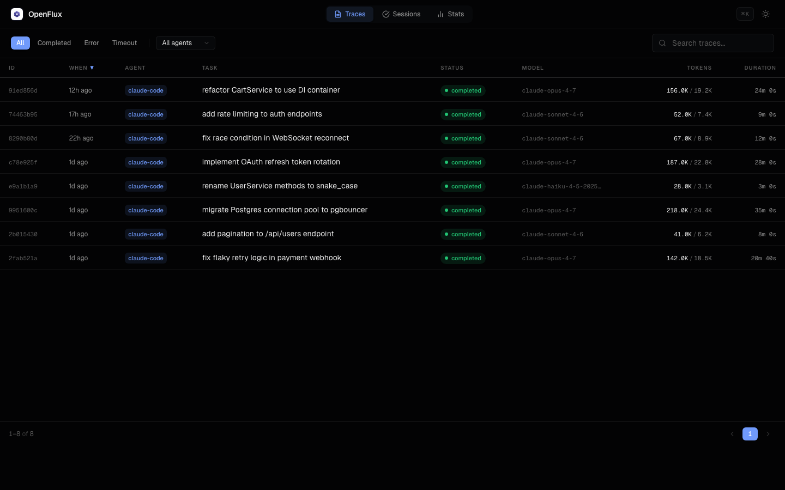
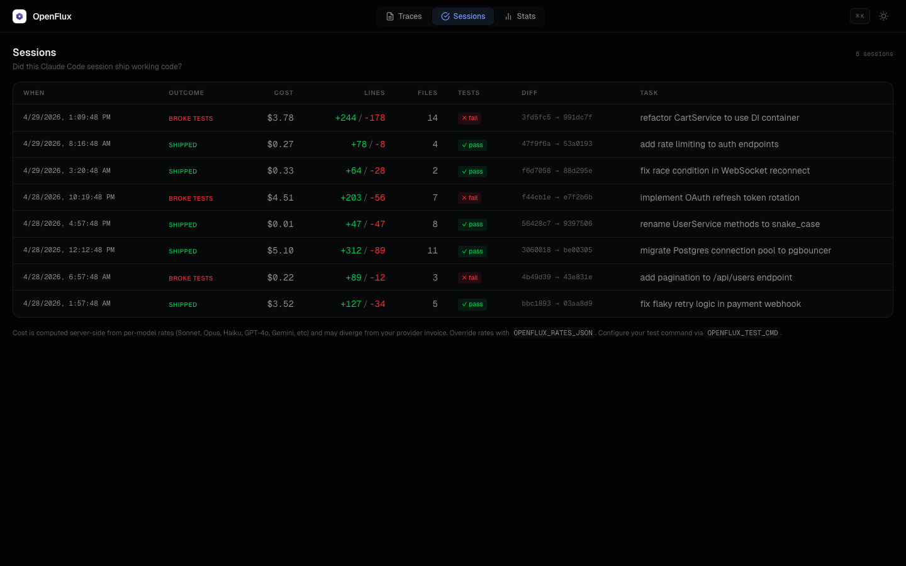

<p align="center">
  <picture>
    
  </picture>
</p>
<h1 align="center">OpenFlux</h1>
<p align="center">
  <em>Find out where your Claude Code budget actually went this week.</em>
</p>
<p align="center">
  <a href="https://pypi.org/project/openflux/"></a>
  <a href="https://pypi.org/project/openflux/"></a>
  <a href="https://www.python.org/downloads/"></a>
  <a href="https://opensource.org/licenses/MIT"></a>
</p>

## The problem

Existing trackers say "you spent $200 this week." They don't say:

- which sessions cost the most and why
- how much of your input went to cache misses you paid full price for
- whether you're stuck in a loop calling the same tool with the same input
- whether you'll cross your daily budget at the rate you're going

If you've ever hit your weekly limit while a tracker said you were at 10%, that's why. OpenFlux runs locally, hooks into your Claude Code sessions, and gives you the breakdown.

## Install

```bash
pip install openflux
openflux install claude-code
```

The `install` command writes lifecycle hooks into `~/.claude/settings.json`, idempotent on re-run. From then on every Claude Code session is captured to `~/.openflux/traces.db`. No data leaves your machine.

```bash
openflux serve         # dashboard at http://localhost:5173
openflux cost          # CLI: total spend, cache hit ratio, burn rate
openflux sessions      # CLI: per-session cost, sortable by cost / cache / time
openflux anomalies     # CLI: spikes, cache misses, error storms, agent loops
openflux budget set 10 # daily cap, $/day; check with `openflux budget check`
```

## Cost forensics

<p align="center">
  
</p>

The **Waste** tab in the dashboard answers the questions ccusage and CodeBurn don't:

- **Cache savings.** Total dollars saved by Anthropic's prompt caching versus what you'd have paid at full input rate. The headline number; on healthy usage this is tens or hundreds of dollars. (Cache hit ratio is shown alongside but stays near 100% on healthy traffic so it's mostly informational; the dollar amount is what to act on.)
- **Uncached input cost per session.** Dollars paid at full input rate, surfaced both in the dashboard and via `openflux sessions --sort cache`. The actionable "cache pain" metric: sessions paying real money on un-cached prefixes float to the top instead of getting buried by the saturated ratio.
- **Burn rate.** Daily spend over the window, projected to month-end at the current rate.
- **Per-session cost.** Sortable by cost, by cache pain, or by time. Useful for finding the one session that cost more than the other ten put together.
- **Anomaly detection.** Four classes, each tied to a real failure mode:
  - **Cost spikes** — sessions costing 3x+ the rolling average.
  - **Cache misses** — sessions with significant input tokens and 0% cache hits.
  - **Error storms** — 50%+ of tool calls failed in a session.
  - **Agent loops** — same tool called 4+ times consecutively with identical input.

  All four classes work for both live `openflux install claude-code` capture and `openflux backfill` databases (per-tool detail is reconstructed from the transcript's `tool_use` / `tool_result` blocks).
- **Budget cap.** Set a daily ceiling with `openflux budget set <amount>`. `openflux budget check` shows spent, remaining, percent used, and projected end-of-day spend at the current pace.

The same data is exposed at `/api/insights`, `/api/insights/sessions`, and `/api/insights/anomalies` if you want to hook a notifier or alert into it.

## Sessions: did this session ship working code?

<p align="center">
  
</p>

OpenFlux also captures the git diff and test result for each Claude Code session. Set `OPENFLUX_TEST_CMD="pytest -q"` (or your own command) and every session shows pass / fail next to the cost. The **Sessions** tab in the dashboard ranks rows by recency. Columns: outcome, cost, lines added/removed, files changed, tests, diff range, original task.

```bash
openflux outcomes              # CLI version of the Sessions tab
openflux outcomes --days 7
```

## How it works

```
Claude Code hooks --> OpenFlux adapter --> SQLite (~/.openflux/traces.db)
                                            |
                                            +-> dashboard (openflux serve)
                                            +-> CLI (openflux cost / sessions / anomalies / budget / outcomes)
                                            +-> JSON or OTLP sinks (optional)
```

Captured per session: model, every tool call, token usage by message (input / output / cache-read / cache-creation), MCP tool registrations, files modified, git diff at start and end, test command exit code if `OPENFLUX_TEST_CMD` is set. SQLite with FTS5 for search; schema migrations are versioned and idempotent.

For Claude Code, cost is computed from `billable_messages` (deduplicated by Anthropic `message.id` so the same API call across resumed or forked transcripts is counted once). For other adapters it falls back to per-trace token aggregates.

## Other dashboard tabs

`openflux serve` also gives you:

- **Traces** — sortable raw trace explorer, status / agent filters, full-text search via FTS5, click-through detail panel with overview / tools / sources / raw JSON tabs.
- **Stats** — token usage over time, traces per day, aggregate metrics. Light and dark mode.

## CLI reference

```bash
# Cost forensics
openflux cost                            # spend total + cache + burn (last 7 days)
openflux cost --days 30
openflux sessions                        # per-session cost, most expensive first
openflux sessions --sort cache           # or sort by cache hit ratio
openflux anomalies                       # cost spikes, cache misses, error storms, loops
openflux budget set 10                   # set daily cap to $10/day
openflux budget check                    # status + EOD projection

# Outcomes
openflux outcomes                        # session-vs-test view (CLI)
openflux outcomes --days 7

# Trace explorer
openflux recent                          # last 10 traces
openflux recent --agent claude-code
openflux search "deploy script"          # full-text across captured content
openflux trace trc-a1b2c3d4e5f6          # one trace, full detail

# Plumbing
openflux serve                           # web dashboard
openflux install claude-code             # write lifecycle hooks
openflux install --list                  # other supported frameworks
openflux export > traces.json            # NDJSON dump
openflux backfill                        # import historical Claude Code transcripts
openflux forget --agent old-agent        # delete by agent
openflux prune --days 90                 # delete by age
openflux status                          # db path + counts
```

## Other frameworks

Claude Code is the wedge. The Trace schema is framework-agnostic and OpenFlux ships adapters for the rest of the agent ecosystem (OpenAI Agents SDK, LangChain / LangGraph, Claude Agent SDK, AutoGen, CrewAI, Google ADK, Amazon Bedrock, MCP) so the same dashboard, sinks, and CLI work everywhere. Coverage table and per-framework setup live in [docs/adapters.md](docs/adapters.md).

## Compared to other Claude Code tools

The space already has [ccusage](https://github.com/ryoppippi/ccusage) (cost reporting) and [CodeBurn](https://github.com/getagentseal/codeburn) (per-tool waste grading). OpenFlux overlaps both but adds the per-session cache discipline view, the four-class anomaly detector, the daily budget cap with EOD projection, and the diff-vs-test outcome link.

See [docs/comparison.md](docs/comparison.md) for the side-by-side, including when not to pick OpenFlux.

## Configuration

All env vars, no config files.

| Variable | Default | Purpose |
|---|---|---|
| `OPENFLUX_DB_PATH` | `~/.openflux/traces.db` | SQLite database location |
| `OPENFLUX_TEST_CMD` | unset | Shell command to run at session end. Exit 0 means `tests_passed=true`. Example: `pytest -q` |
| `OPENFLUX_OTLP_ENDPOINT` | `http://localhost:4318` | OTLP/HTTP endpoint for export |
| `OPENFLUX_FIDELITY` | `full` | `full` (raw content) or `redacted` (hash-only) |
| `OPENFLUX_EXCLUDE_PATHS` | `*.env,*credentials*,...` | Glob patterns to exclude from content storage |

## Schema

A Trace captures one complete unit of agent work:

- **Identity**: id, timestamp, agent, session_id, parent_id
- **What happened**: task, decision, status, correction
- **Provenance**: context given, searches run, sources read, tools called
- **Metrics**: token usage, duration, turn count, files modified
- **Extensibility**: tags, scope, metadata dict

Full schema definition in [docs/schema.md](docs/schema.md).

## Sinks

| Sink | Description | Config |
|------|-------------|--------|
| **SQLite** | Default. Zero-config, FTS5 search, schema migrations. | `OPENFLUX_DB_PATH` |
| **OTLP** | Raw HTTP POST to any OpenTelemetry collector. No SDK needed. | `OPENFLUX_OTLP_ENDPOINT` |
| **JSON** | NDJSON to stdout. Pipe to files, jq, or other tools. | -- |

## Roadmap

- [ ] Mid-session budget alerts via PostToolUse hook (notify when crossing a $/session ceiling, before the session ends)
- [ ] Per-tool / per-MCP-server / per-subagent cost attribution within a session
- [ ] Week-over-week diff view (compare two date ranges to spot regressions)
- [ ] Cursor + aider adapters with the same outcome capture
- [ ] PR-merged correlation (mark sessions whose diff was merged in the public history)
- [ ] Webhook sink (POST traces to any URL)
- [ ] Trace retention policies (auto-prune by age or DB size)
- [ ] Multi-machine sync of `traces.db`

## Development

```bash
git clone https://github.com/advitrocks9/openflux.git
cd openflux
uv sync --all-extras

uv run pytest tests/ -v          # tests
uv run ruff check src/ tests/    # lint
uv run ruff format src/ tests/   # format
uv run pyright src/              # type check
```

Frontend (only needed if modifying the dashboard):

```bash
cd frontend
npm install
npm run dev    # dev server on :5174, proxies API to :5173
npm run build  # builds to src/openflux/static/
```

## License

[MIT](LICENSE)
